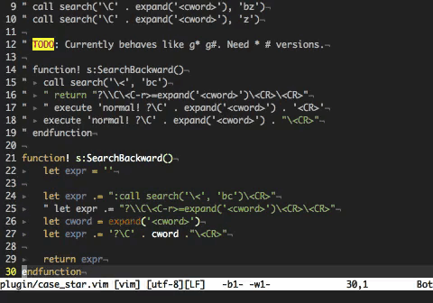

vim-git-todo
============

Use the [`git todo`][git-todo] command to search for TODO lines and load them
into the quickfix list.

## Demo

## License
Copyright © 2020 Teddy Wing. Licensed under the GNU GPLv3+ (see the included
COPYING file).

[git-todo]: https://github.com/teddywing/git-todo
